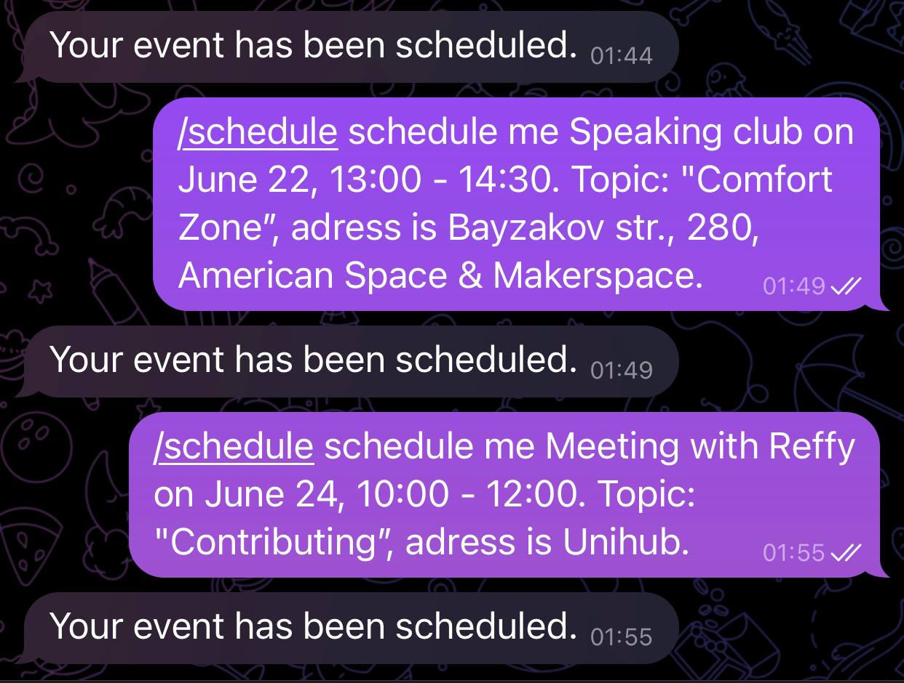

# Calendar Assist Project

This is a Python project that includes a script to schedule an event on a calendar via a bot on the Telegram platform.

The bot uses the GPT-3.5-turbo model from OpenAI to process natural language commands and convert them into JSON-based calendar event data. This data is then sent to a specific calendar using the Cronofy API.



## Getting Started

These instructions will get you a copy of the project up and running on your local machine for development and testing purposes.

### Prerequisites

-   Python 3.6+
-   pip
-   A Cronofy account for calendar management
-   A Telegram account to setup the bot
-   An OpenAI account for accessing the GPT-3.5-turbo model

### Installation

1. Clone the repo

    ```
    git clone https://github.com/qcanser/calendar-assist.git
    ```

2. Navigate into the cloned directory

    ```
    cd calendar-assist
    ```

3. Install the required packages

    ```
    pip install -r requirements.txt
    ```

4. Set up your environment variables. Create a `.env` file in the root directory of your project, and update it with your own credentials:

    ```
    ACCESS_TOKEN=<your cronofy access token>
    CLIENT_SECRET=<your cronofy client secret>
    CALENDAR_ID=<your cronofy calendar id>
    OPENAI_API=<your OpenAI api key>
    API_ID=<your telegram api id>
    API_HASH=<your telegram api hash>
    BOT_TOKEN=<your telegram bot token>
    ALLOWED_USER=<username of the user allowed to use the bot>
    ```

### Running

Run the Telegram bot with the following command:

```
python3 pybot.py
```

## Usage

Once the bot is running, you can interact with it on Telegram.

-   Use `/start` to initiate conversation with the bot.
-   Use `/schedule <event details>` to schedule an event.

Example:

```
/schedule Schedule me a Board meeting in the Board room, describing Discuss plans for the next quarter, for July 16, from 21:30 to 23:00 (UTC+6).
```

The bot will respond with a confirmation after successfully scheduling the event.

## Contributing

Please read [CONTRIBUTING.md](CONTRIBUTING.md) for details on our code of conduct, and the process for submitting pull requests to us.

## License

This project is licensed under the MIT License - see the [LICENSE.md](LICENSE.md) file for details
